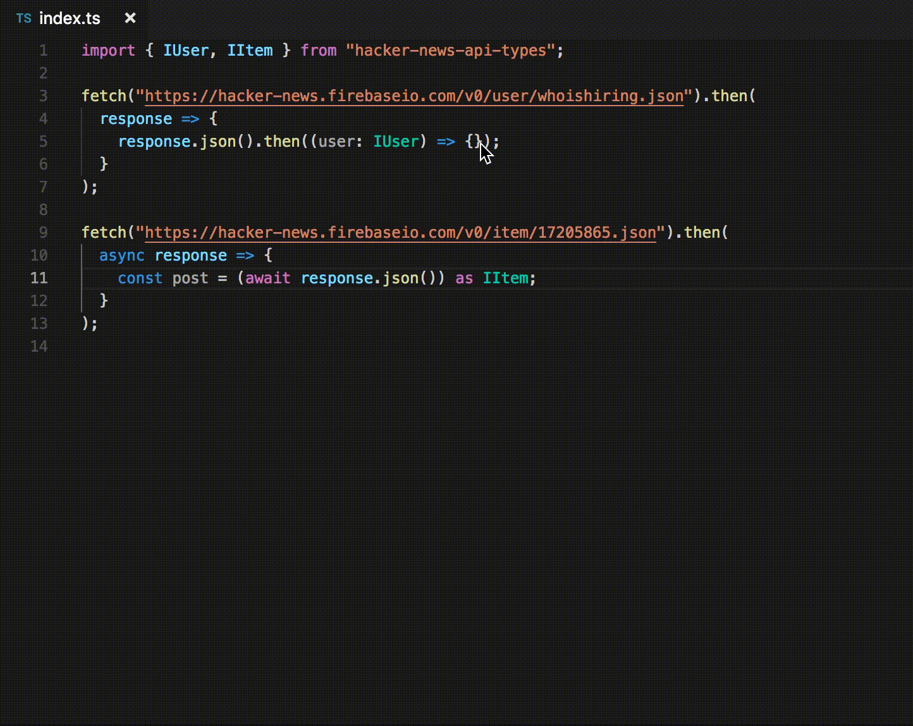

# hacker-news-api-types
TypeScript interfaces for the [Hacker News API](https://github.com/HackerNews/API) JSON data

## Install
`npm install hacker-news-api-types`

## How to use
````TS
import { IUser, IItem } from "hacker-news-api-types";

fetch("https://hacker-news.firebaseio.com/v0/user/whoishiring.json").then(
  response => {
    response.json().then((user: IUser) => user.about);
  }
);

fetch("https://hacker-news.firebaseio.com/v0/item/17205865.json").then(
  async response => {
    const post = (await response.json()) as IItem;
    post.descendants;
  }
);
````

